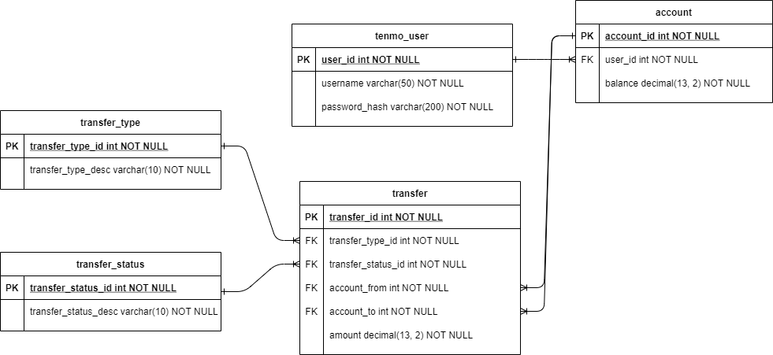

# TE Backend Capstone project
TEnmo is an online payment service for transferring "TE bucks" between friends. This is a command-line application built with Java that uses RESTful API server, Spring MVC model, and PostgreSQL.

## Planned Features
I am currently working on additional functionalities for practice and refactoring existing code.
* (Authenticated) user will be able to **_request_** a transfer of a specific amount of TE Bucks from another registered user.
    * Should be able to choose from a list of users to request TE Bucks from.
    * Must not be allowed to request money from myself.
    * can't request a zero or negative amount.
    * A transfer includes the User IDs of the from and to users and the amount of TE Bucks.
    * A Request Transfer has an initial status of *Pending*.
    * No account balance changes until the request is approved.
    * The transfer request should appear in both users' list of transfers (use case #5).
* User will be able to see **_Pending_** transfers.
* User will be able to either **_approve or reject_** a Request Transfer.
    * Can't "approve" a given Request Transfer for more TE Bucks than user has in the account.
    * The Request Transfer status is Approved if user approves, or Rejected if user rejects the request.
    * If the transfer is approved, the requester's account balance is increased by the amount of the request.
    * If the transfer is approved, the requestee's account balance is decreased by the amount of the request.
    * If the transfer is rejected, no account balance changes.

## Use cases & Requirements (Up-to-date)
As a user of the system, the user is able to:
* Register with a username and password.
    * A new registered user starts with an initial balance of 1,000 TE Bucks.
* Log in using the registered username and password.
    *  Logging in returns an Authentication Token. This token will be included with all the subsequent interactions with the system outside of registering and logging in.

As an _authenticated_ user of the system, the user is able to: 
* See Account Balance.
* **_Send_** a transfer of a specific amount of TE Bucks to a registered user.
    * Choose from a list of users to send TE bucks to.
    * Must not be allowed to send money to myself
    * Can't send a zero/negative amount or more TE bucks that I have in the account
    * A transfer indlcues the user IDs of the from and to users and the amount of TE bucks
    * The receiver's account balance is increased by the amount of the transfer.
    * The server's account balance is decreased by the amount of the transfer.
    * A Sending Transfer has an initial status of *Approved*
*  See transfers user has sent or received.
* Retrieve the details of any transfer based upon the transfer ID.


## Sample screens

### View Current balance
```
Your current account balance is: $9999.99
```

### Send TE Bucks
```
-------------------------------------------
Users
ID          Name
-------------------------------------------
313         Bernice
54          Larry
---------

Enter ID of user you are sending to (0 to cancel):
Enter amount:
```

### View transfers
```
-------------------------------------------
Transfers
ID          From/To                 Amount
-------------------------------------------
23          From: Bernice          $ 903.14
79          To:    Larry           $  12.55
---------
Please enter transfer ID to view details (0 to cancel): "
```

### Transfer details
```
--------------------------------------------
Transfer Details
--------------------------------------------
 Id: 23
 From: Bernice
 To: Me Myselfandi
 Type: Send
 Status: Approved
 Amount: $903.14
```

### Requesting TE Bucks
```
-------------------------------------------
Users
ID          Name
-------------------------------------------
313         Bernice
54          Larry
---------

Enter ID of user you are requesting from (0 to cancel):
Enter amount:
```

###  Pending requests
```
-------------------------------------------
Pending Transfers
ID          To                     Amount
-------------------------------------------
88          Bernice                $ 142.56
147         Larry                  $  10.17
---------
Please enter transfer ID to approve/reject (0 to cancel): "
```

### Approve or reject pending transfer
```
1: Approve
2: Reject
0: Don't approve or reject
---------
Please choose an option:
```

## Database schema



### `tenmo_user` table

Stores the login information for users of the system.

| Field           | Description                                                                    |
|-----------------|--------------------------------------------------------------------------------|
| `user_id`       | Unique identifier of the user                                                  |
| `username`      | String that identifies the name of the user; used as part of the login process |
| `password_hash` | Hashed version of the user's password                                          |
| `role`          | Name of the user's role                                                        |

### `account` table

Stores the accounts of users in the system.

| Field           | Description                                                        |
| --------------- | ------------------------------------------------------------------ |
| `account_id`    | Unique identifier of the account                                   |
| `user_id`       | Foreign key to the `users` table; identifies user who owns account |
| `balance`       | The amount of TE bucks currently in the account                    |

### `transfer_type` table

Stores the types of transfers that are possible.

| Field                | Description                             |
| -------------------- | --------------------------------------- |
| `transfer_type_id`   | Unique identifier of the transfer type  |
| `transfer_type_desc` | String description of the transfer type |

There are two types of transfers:

| `transfer_type_id` | `transfer_type_desc` | Purpose                                                                |
| ------------------ | -------------------- | ---------------------------------------------------------------------- |
| 1                  | Request              | Identifies transfer where a user requests money from another user      |
| 2                  | Send                 | Identifies transfer where a user sends money to another user           |

### `transfer_status` table

Stores the statuses of transfers that are possible.

| Field                  | Description                               |
| ---------------------- | ----------------------------------------- |
| `transfer_status_id`   | Unique identifier of the transfer status  |
| `transfer_status_desc` | String description of the transfer status |

There are three statuses of transfers:

| `transfer_status_id` | `transfer_status_desc` |Purpose                                                                                 |
| -------------------- | -------------------- | ---------------------------------------------------------------------------------------  |
| 1                    | Pending                | Identifies transfer that hasn't occurred yet and requires approval from the other user |
| 2                    | Approved               | Identifies transfer that has been approved and occurred                                |
| 3                    | Rejected               | Identifies transfer that wasn't approved                                               |

### `transfer` table

Stores the transfers of TE bucks.

| Field                | Description                                                                                     |
| -------------------- | ----------------------------------------------------------------------------------------------- |
| `transfer_id`        | Unique identifier of the transfer                                                               |
| `transfer_type_id`   | Foreign key to the `transfer_types` table; identifies type of transfer                          |
| `transfer_status_id` | Foreign key to the `transfer_statuses` table; identifies status of transfer                     |
| `account_from`       | Foreign key to the `accounts` table; identifies the account that the funds are being taken from |
| `account_to`         | Foreign key to the `accounts` table; identifies the account that the funds are going to         |
| `amount`             | Amount of the transfer                                                                          |


## How the database is set up

Create a new Postgres database called `tenmo`. Run the `database/tenmo.sql` script in pgAdmin to set up the database.

### Datasource

A Datasource has been configured in `/src/resources/application.properties`. 

```
# datasource connection properties
spring.datasource.url=jdbc:postgresql://localhost:5432/tenmo
spring.datasource.name=tenmo
spring.datasource.username=postgres
spring.datasource.password=postgres1
```


## Authentication

The user registration and authentication functionality for the system has already been implemented. After successful authentication, an instance of `AuthenticatedUser` is stored in the `currentUser` member variable of `App`. The user's authorization token—JWT—can be accessed from `App` as `currentUser.getToken()`.

When the use cases refer to an "authenticated user", this means a request that includes the token as a header. You can also reference other information about the current user by using the `User` object retrieved from `currentUser.getUser()`.
